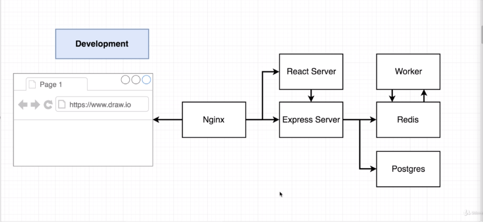

# docker-multiple-images

This is a simple app for count a number, we call it Fibonacci-apps. Build
base on ReactJS for client-side, NodeJS for server-side, with Redis for keep the
temporary number, and Postgres for keep Fibonacci number on database.

**Worker** folder is to count the number that was came from client-side, this is the
app structure in development environment,

I choose Nginx for handling the request on the client-side and server.


## Getting Started

These instructions will get you a copy of the project up and running on your local machine for development and testing purposes.

### Installing for development environment

1. Clone the repo

```
git clone https://github.com/agungTuanany/docker-multiple-images.git
```

2. create images and test,

```
cd client/
docker build -f Dockerfile.dev -t client/docker-react .

# to test that your client images didn't have an error
docker run client/docker-react

cd server/
docker build -f Dockerfile.dev -t server/docker-react .

# to test that your server images didn't have an error
docker run server/docker-react

cd worker/
docker build -f Dockerfile.dev -t worker/docker-react .

# to test that your worker images didn't have an error
docker run worker/docker-react
```

3. run all images with docker-compose

```
# on your root dir
docker-compose up --build   # --build for rebuild images

# or you can run command
docker-compose up
```
4. Explore

```
#open your web-browser
localhost:3050
```
## Built With

* React
* Node.js
* axios
* Express
* Redis
* Postgres

## plugin
* axios
* body-parser
* cors
* express
* react
* react-dom
* react-router-dom
* react-script
* pg
* redis
## License

This project is licensed under the MIT License - see the [LICENSE.md](LICENSE.md) file for details

## Acknowledgments
 [@stephengrider](https://github.com/StephenGrider)

